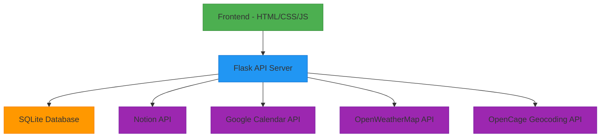

# Personal Task Planner Bot

A comprehensive personal task management application with AI assistance, Notion integration, Google Calendar synchronization, location-based recommendations, and intelligent notifications.


## Table of Contents
- [Features](#features)
- [Architecture](#architecture)
- [Prerequisites](#prerequisites)
- [Installation](#installation)
- [Configuration](#configuration)
- [Usage](#usage)
- [API Endpoints](#api-endpoints)
- [Integrations](#integrations)
- [Development](#development)
- [Contributing](#contributing)
- [License](#license)

## Features

### Core Task Management
- **Priority-based Task Organization**: Tasks categorized by priority levels (High, Medium, Low)
- **Task Dependencies**: Define dependencies between tasks to ensure proper execution order
- **Duration Estimation**: Specify estimated time required for each task
- **Task Completion Tracking**: Mark tasks as completed and track progress

### Smart Scheduling
- **Weather-aware Scheduling**: Automatically reschedule outdoor tasks based on weather conditions
- **Location-based Recommendations**: Suggest tasks based on your current location
- **Intelligent Prioritization**: AI-powered task prioritization considering multiple factors
- **Calendar Integration**: Sync with Google Calendar events

### Productivity Analytics
- **Progress Tracking**: Visual progress indicators for daily tasks
- **Productivity Reports**: Generate detailed analytics on task completion patterns
- **Time Management Insights**: Analyze time spent on different task categories

### Communication
- **AI Assistant Chatbot**: Natural language interface for task management
- **Motivational Quotes**: Daily inspirational quotes to boost productivity
- **Smart Notifications**: Context-aware alerts for tasks and events

### Data Integration
- **Notion Integration**: Import tasks from Notion databases and sync completion status
- **Google Calendar Sync**: Import calendar events as tasks and export tasks to calendar
- **Cross-platform Compatibility**: Works on desktop and mobile browsers

## Architecture

The application follows a client-server architecture with a Flask backend and a modern JavaScript frontend.



## Prerequisites

- **Python 3.8 or later**
- **Node.js** (for development tools)
- **Internet connection** (for API integrations)
- **Web browser** (Chrome, Firefox, Safari, or Edge)

## Installation

### Windows
1. Clone or download the repository
2. Double-click `start_app.bat` to automatically install dependencies and start the application

### Manual Installation
1. Clone the repository:
   ```bash
   git clone https://github.com/Naveenkm007/puni-14102025.git
   cd puni-14102025
   ```

2. Install required packages:
   ```bash
   pip install -r requirements.txt
   ```

3. Start the application:
   ```bash
   python api.py
   ```

4. Open `index.html` in your browser or navigate to `http://localhost:5000`

## Configuration

### Environment Variables

Copy the example configuration file and customize it with your credentials:

```bash
cp .env.example .env
```

Edit the `.env` file with your actual credentials:

```env
# Notion Integration
NOTION_TOKEN=your_notion_integration_token
NOTION_DATABASE_ID=your_notion_database_id

# Weather API (OpenWeatherMap)
WEATHER_API_KEY=your_openweathermap_api_key

# Google Calendar API
GOOGLE_CALENDAR_CREDENTIALS_PATH=credentials.json

# Flask Settings
FLASK_HOST=localhost
FLASK_PORT=5000
FLASK_DEBUG=True

# Database
DATABASE_PATH=task_planner.db

# Task Settings
DEFAULT_WORK_START_HOUR=9
DEFAULT_WORK_END_HOUR=17
DEFAULT_BREAK_DURATION=15
DEFAULT_TASK_LENGTH=60
```

### API Keys Setup

#### Notion Integration
1. Create a Notion integration at [Notion Developers](https://www.notion.so/my-integrations)
2. Share your task database with the integration
3. Copy the integration token to `NOTION_TOKEN`
4. Copy your database ID to `NOTION_DATABASE_ID`

#### Google Calendar Integration
1. Create a project in [Google Cloud Console](https://console.cloud.google.com/)
2. Enable the Google Calendar API
3. Create OAuth 2.0 credentials for a Desktop application
4. Download the credentials JSON file
5. Place it in the application directory as `credentials.json`

#### Weather API
1. Sign up at [OpenWeatherMap](https://openweathermap.org/api)
2. Generate an API key
3. Copy the key to `WEATHER_API_KEY`

## Usage

### Getting Started
1. Run the application using `start_app.bat` or manually start the server
2. Open your browser and navigate to `http://localhost:5000`
3. The application will automatically detect your location
4. Configure your integrations in the `.env` file

### Task Management
- **Add Tasks**: Use the chat interface with commands like "Add meeting with client at 2pm"
- **Import Tasks**: Click "Import Notion Tasks" or "Import Calendar Events"
- **Complete Tasks**: Click the checkbox next to any task to mark it as completed
- **View Progress**: Check the progress bar at the top of the tasks section

### Navigation
- **Today/Tomorrow Toggle**: Switch between today's and tomorrow's tasks
- **Notification Settings**: Configure which notifications you want to receive
- **Theme Toggle**: Switch between light and dark mode

### AI Assistant Commands
- "Add [task description]" - Create a new task
- "What's my priority task?" - Get your most important task
- "Import tasks from Notion" - Import tasks from your Notion database
- "Import calendar events" - Import events from Google Calendar
- "Generate productivity report" - Get analytics on your task completion
- "Where am I?" - Get your current location information

## API Endpoints

### Task Management
- `GET /api/tasks` - Retrieve all tasks
- `POST /api/tasks/<task_id>/complete` - Mark a task as completed

### Notion Integration
- `POST /api/notion/import` - Import tasks from Notion database
  ```json
  {
    "database_id": "your_database_id",
    "notion_token": "your_token",
    "user_id": "default_user"
  }
  ```
- `POST /api/notion/sync` - Sync task completion to Notion

### Google Calendar Integration
- `POST /api/calendar/import` - Import events from Google Calendar as tasks
  ```json
  {
    "user_id": "default_user"
  }
  ```

## Integrations

### Notion Integration
The application seamlessly integrates with Notion to import tasks and sync completion status.

**Features:**
- Import tasks from Notion databases
- Sync task completion status back to Notion
- Support for task properties (title, priority, status, tags)
- Visual indication of Notion-imported tasks

**Setup:**
1. Create a Notion integration
2. Share your database with the integration
3. Configure `NOTION_TOKEN` and `NOTION_DATABASE_ID` in `.env`

### Google Calendar Integration
Synchronize your calendar events with the task planner for comprehensive scheduling.

**Features:**
- Import calendar events as tasks
- Visual indication of calendar-imported tasks
- Automatic duration calculation from event times
- Support for event details (title, description, location)

**Setup:**
1. Create Google Cloud project and enable Calendar API
2. Download credentials JSON
3. Place as `credentials.json` in project directory

### Weather Integration
Weather-aware task scheduling to optimize your outdoor activities.

**Features:**
- Automatic weather detection based on location
- Weather-dependent task rescheduling
- Weather alerts for planning adjustments
- Integration with OpenWeatherMap API

### Location Services
Location-based task recommendations and context-aware planning.

**Features:**
- Automatic location detection
- Reverse geocoding for city/country identification
- Location-based task suggestions
- Integration with OpenCage Geocoding API

## Development

### Project Structure
```
personal-task-planner-bot/
├── api.py                 # Flask API server
├── app.js                 # Frontend JavaScript logic
├── config.py              # Configuration management
├── index.html             # Main HTML interface
├── setup.py               # Package setup
├── start_app.bat          # Windows startup script
├── style.css              # Styling
├── task_planner_bot_implementation.py  # Core backend logic
├── .env.example           # Environment variables template
├── requirements.txt       # Python dependencies
├── README.md              # Project documentation
└── diagrams/              # Architecture and flow diagrams
```

### Technology Stack
- **Frontend**: HTML5, CSS3, JavaScript (ES6+)
- **Backend**: Python 3.8+, Flask
- **Database**: SQLite
- **AI/ML**: LangChain, OpenAI
- **APIs**: Notion, Google Calendar, OpenWeatherMap, OpenCage
- **Authentication**: OAuth 2.0 (Google), Bearer Tokens (Notion)

### Key Components
1. **AgenticPlanner**: Core AI task planning engine
2. **DatabaseManager**: SQLite database interface
3. **NotificationService**: Browser notification system
4. **LocationService**: Geolocation and reverse geocoding
5. **WeatherService**: Weather data integration
6. **CalendarIntegration**: Google Calendar API wrapper
7. **NotionIntegration**: Notion API wrapper

### Running Tests
```bash
# TODO: Add test running instructions
```

### Building for Production
```bash
# TODO: Add production build instructions
```

## Contributing

We welcome contributions to the Personal Task Planner Bot! Here's how you can help:

1. Fork the repository
2. Create a feature branch (`git checkout -b feature/AmazingFeature`)
3. Commit your changes (`git commit -m 'Add some AmazingFeature'`)
4. Push to the branch (`git push origin feature/AmazingFeature`)
5. Open a Pull Request

### Development Guidelines
- Follow the existing code style
- Write clear, descriptive commit messages
- Add tests for new features
- Update documentation as needed
- Ensure all tests pass before submitting PR

## License

This project is licensed under the MIT License - see the [LICENSE](LICENSE) file for details.

## Support

For support, please open an issue on the GitHub repository or contact the maintainers.

---

*Personal Task Planner Bot - Making task management intelligent and effortless*